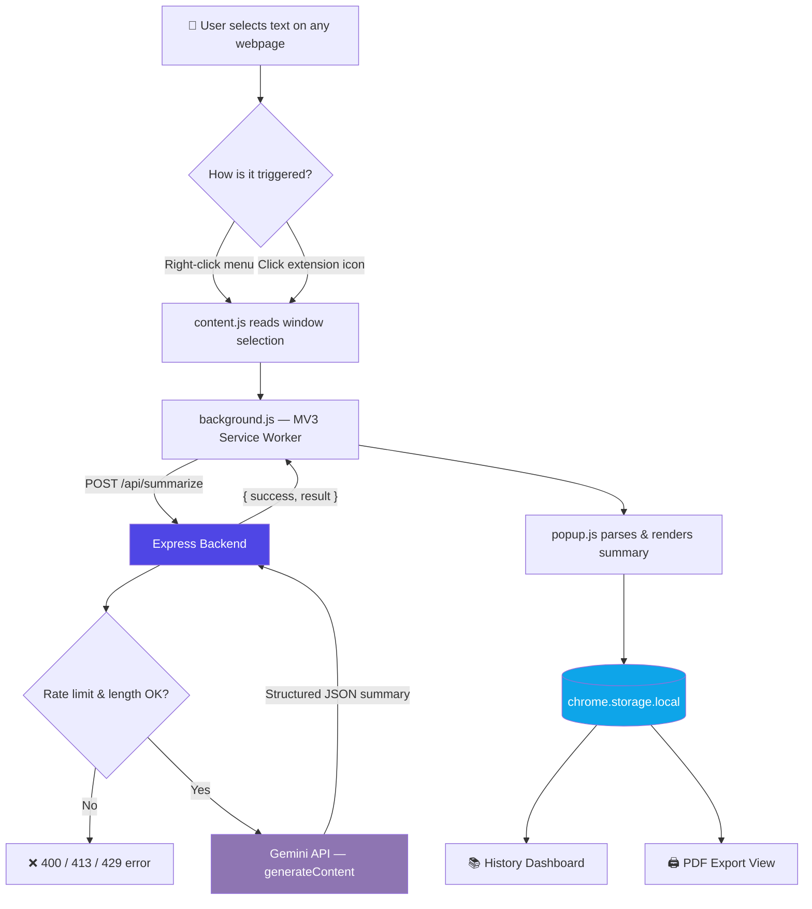
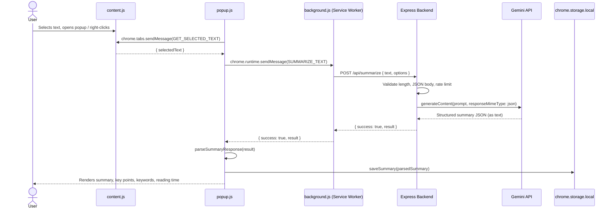

<div align="center">

# 🧠 AI Web Summarizer

### An Open-Source Chrome Extension for Instant AI-Powered Webpage Summarization with Google Gemini

**Select any text on the web → get a structured AI summary, key points, key concepts, and keywords in seconds — without ever leaving the page.**

[](https://developer.chrome.com/docs/extensions/mv3/intro/)
[](https://ai.google.dev/)
[](https://nodejs.org/)
[](./LICENSE)

[](https://github.com/tusharkkp/AI-Web-Summarizer-Extension/stargazers)
[](https://github.com/tusharkkp/AI-Web-Summarizer-Extension/network/members)
[](https://github.com/tusharkkp/AI-Web-Summarizer-Extension/issues)
[](https://github.com/tusharkkp/AI-Web-Summarizer-Extension/commits/main)
[](#-contributing)
[](#-installation-guide)

[Features](#-features) •
[Architecture](#-architecture--workflow) •
[Installation](#-installation-guide) •
[API Docs](#-api-documentation) •
[Roadmap](#-future-scope--roadmap) •
[Contributing](#-contributing)

</div>

---

## 📌 Table of Contents

1. [Problem Statement](#-problem-statement)
2. [Features](#-features)
3. [Screenshots & Demo](#-screenshots--demo)
4. [Architecture & Workflow](#-architecture--workflow)
5. [Tech Stack](#-tech-stack)
6. [Project / Folder Structure](#-project--folder-structure)
7. [Installation Guide](#-installation-guide)
8. [Environment Variables](#-environment-variables)
9. [Usage Guide](#-usage-guide)
10. [API Documentation](#-api-documentation)
11. [Security & Privacy](#-security--privacy)
12. [Performance & Scalability](#-performance--scalability)
13. [Future Scope / Roadmap](#-future-scope--roadmap)
14. [Contributing](#-contributing)
15. [License](#-license)
16. [Author & Credits](#-author--credits)

---

## 🎯 Problem Statement

The modern web is drowning in text. Long-form articles, dense documentation, verbose blog posts, and research papers force readers to spend minutes scanning content just to decide if it's worth reading — a real productivity tax for students, developers, researchers, and knowledge workers alike.

**AI Web Summarizer** solves this by turning any *highlighted text on any webpage* into a clean, structured summary — instantly, without copy-pasting into a separate AI chat tab or browser extension that leaks your API key to the client.

### Pain points this project solves

| Problem | How AI Web Summarizer Solves It |
|---|---|
| 📖 Too much text, too little time | One-click **AI text summarization** of any selected content, right in the browser |
| 🔑 Extensions that expose API keys in client-side code | Gemini API key lives **only** in the backend — never shipped to the browser |
| 🧵 Losing track of what you've already read | Built-in **searchable summary history** with favorites and stats |
| 🌍 Non-English readers underserved by AI tools | Native **multi-language summary output** (English, Hindi, Spanish, French, German) |
| 📤 No easy way to save or share insights | One-click **copy to clipboard** and **export to PDF** |
| 🐌 Generic summaries that miss nuance | Configurable **summary length + writing style** (bullet points, executive brief, study notes) |

If you've ever searched for a **free AI summarizer Chrome extension**, a **Gemini-powered text summarization tool**, or a **Manifest V3 productivity extension** that keeps your API keys secure, this project is built for exactly that use case.

---

## ✨ Features

### 🤖 Core AI Capabilities
- **Instant text summarization** of any selected webpage content using the **Google Gemini API**
- Structured output every time: **summary, key points, key concepts, keywords, and estimated reading time**
- **3 summary lengths** — Short, Standard, Detailed
- **4 writing styles** — Balanced, Bullet Points, Executive Brief, Study Notes
- **5 output languages** — English, Hindi, Spanish, French, German
- Strict **JSON-mode prompting** with source-text delimiting to reduce prompt injection risk from page content

### 🖱️ User-Facing Features
- **Right-click → "Summarize with AI"** context menu on any selected text
- Clean, responsive **popup UI** with light/dark theme (persisted across sessions)
- **Summary history dashboard** — search, filter, and revisit every past summary
- **Favorites** system to pin your most useful summaries
- **Live stats** — total summaries, favorites, and summaries created this week
- **One-click copy** to clipboard in a clean, shareable text format
- **Export to PDF** via a dedicated print-friendly view (`Ctrl+P → Save as PDF`)

### 🛠️ Technical & Developer Features
- Built on **Manifest V3** using a background **service worker** (no persistent background page)
- **Zero build tooling** — plain HTML/CSS/JS, so anyone can read, fork, and modify the code instantly
- **API-key-free client** — all Gemini calls are proxied through a minimal Express backend
- **Configurable rate limiting** (per-IP, in-memory, environment-driven)
- **Request size guards** — 40,000-character text cap and 200 KB JSON body limit
- **CORS allow-listing** for locking the API down to your published extension ID
- `chrome.storage.local`-based persistence — no external database required

---


---

## 🏗 Architecture & Workflow

AI Web Summarizer is a **two-part system**: a lightweight Manifest V3 Chrome extension (client) and a minimal Express.js backend (server) that owns the Gemini API key. The extension never talks to Gemini directly — every request is proxied through the backend, which is the core security design decision of this project.

### High-level system architecture



### Request lifecycle (sequence diagram)



### Why this architecture?

- **Popup vs. Background separation** — `popup.js` owns rendering and user interaction only. `background.js` owns the context menu and all network calls, so the extension keeps working correctly even if the popup isn't open when a context-menu summary is requested.
- **Backend as a security boundary** — the Gemini API key lives only in `backend/.env` and is read via `process.env`. It is never bundled into extension JavaScript, so it can't be extracted from the published `.crx`/unpacked source.
- **No database** — summary history is inherently personal and low-volume, so `chrome.storage.local` is used instead of standing up and paying for a database.

---

## 🧰 Tech Stack

### Frontend — Chrome Extension (Client)

| Technology | Why it was used |
|---|---|
|  | Semantic markup for the popup, history, and export views |
|  | CSS custom properties (`--primary`, `--bg`, etc.) drive instant light/dark theming without a CSS framework |
|  | Vanilla ES6+ modules — zero build step, instant `Load unpacked` iteration, minimal attack surface |
|  | `chrome.storage`, `chrome.contextMenus`, `chrome.scripting`, and `chrome.action` APIs power selection capture, menus, and persistence |

### Backend — API Server

| Technology | Why it was used |
|---|---|
|  | Lightweight JS runtime, same language as the extension for a shared mental model |
|  | Minimal, battle-tested routing layer for the single `/api/summarize` responsibility |
|  | Keeps secrets like `GEMINI_API_KEY` out of source control |
| **Custom in-memory rate limiter** | Protects the Gemini quota and prevents abuse without adding an external dependency for a small-scale project |

### AI / ML

| Technology | Why it was used |
|---|---|
|  | `gemini-2.5-flash` (configurable via `GEMINI_MODEL`) is used with `responseMimeType: application/json` so the model returns strictly-structured summary data instead of free-form prose |

### Data & Storage

| Technology | Why it was used |
|---|---|
| **`chrome.storage.local`** | Client-side, per-user key-value store — no server-side database needed for personal summary history, favorites, and theme settings |

### Deployment & Tooling

| Technology | Why it was used |
|---|---|
| **Self-hosted / any Node host** (Render, Railway, Fly.io, a VPS, etc.) | The backend is a plain Express app with no platform lock-in — deploy it anywhere Node.js runs |
| **Chrome Web Store** | Distribution channel for the packaged extension |
|   | Version control and open-source collaboration |

---

## 📁 Project / Folder Structure

```text
AI-Web-Summarizer-Extension/
├── assets/                     # Extension icons (16px / 48px / 128px)
│   ├── icon16.png
│   ├── icon48.png
│   └── icon128.png
│
├── background/
│   └── background.js           # MV3 service worker: context menu + backend calls
│
├── content/
│   └── content.js               # Injected script — reads window.getSelection()
│
├── popup/
│   ├── popup.html                # Main extension popup UI
│   ├── popup.css
│   └── popup.js                  # Popup interaction logic + rendering
│
├── history/
│   ├── history.html               # Saved-summary dashboard
│   ├── history.css
│   └── history.js                 # Search, stats, favorite, delete
│
├── export/
│   ├── export.html                 # Print-friendly summary view
│   ├── export.css
│   └── export.js                   # Loads a saved summary → window.print()
│
├── services/
│   ├── api.js                       # Bridges popup ↔ background service worker
│   ├── settings.js                  # Theme + preference persistence
│   └── storage.js                   # chrome.storage.local CRUD helpers
│
├── utils/
│   ├── constants.js                  # BACKEND_URL, limits, dropdown option lists
│   ├── formatter.js                  # Parses Gemini JSON, formats for clipboard/date
│   └── helpers.js
│
├── backend/                           # Express API — owns the Gemini API key
│   ├── middleware/
│   │   └── rateLimit.js                # Per-IP in-memory rate limiter
│   ├── routes/
│   │   └── summary.js                  # POST /api/summarize
│   ├── services/
│   │   └── gemini.js                   # Prompt construction + Gemini fetch call
│   ├── .env.example                    # Template for local environment variables
│   ├── package.json
│   └── server.js                       # Express app entry point, CORS, error handling
│
├── manifest.json                        # Chrome Extension Manifest V3 configuration
└── README.md
```

**Key directories explained:**
- **`background/`** is the only place that talks to the backend — this centralizes network logic and keeps the extension working from the context menu even when the popup is closed.
- **`services/`** and **`utils/`** are shared, dependency-free modules loaded via `<script>` tags across `popup/`, `history/`, and `export/` — no bundler required.
- **`backend/`** is a fully independent Node.js project with its own `package.json`; it can be deployed separately from the extension itself.

---

## 🚀 Installation Guide

### Prerequisites

- [Google Chrome](https://www.google.com/chrome/) or any Chromium-based browser (Edge, Brave, etc.)
- [Node.js 18+](https://nodejs.org/) and npm
- A free **Google Gemini API key** from [Google AI Studio](https://aistudio.google.com/app/apikey)
- `git` installed locally

### 1. Clone the repository

```bash
git clone https://github.com/tusharkkp/AI-Web-Summarizer-Extension.git
cd AI-Web-Summarizer-Extension
```

### 2. Set up the backend

```bash
cd backend
npm install
cp .env.example .env
```

Open `backend/.env` and add your Gemini API key:

```env
GEMINI_API_KEY=your_actual_gemini_api_key_here
```

### 3. Run the backend server

```bash
npm start
```

For auto-reload during development:

```bash
npm run dev
```

You should see:

```
Server running on port 3000
```

### 4. Load the extension in Chrome

1. Open `chrome://extensions` in your browser
2. Enable **Developer mode** (top-right toggle)
3. Click **Load unpacked**
4. Select the **root project folder** (the one containing `manifest.json` — not the `backend` folder)
5. Pin the extension for quick access from the toolbar

### 5. Try it out

1. Highlight some text on any webpage
2. Either click the **AI Web Summarizer** icon, or **right-click → "Summarize with AI"**
3. Read your structured summary, key points, and keywords

> 💡 **Reload the extension** from `chrome://extensions` after editing `manifest.json`, `background/background.js`, or any file loaded by the extension.

### Build instructions (for publishing)

This project intentionally ships with **no bundler or build step** — it runs directly as plain HTML/CSS/JS. To package it for the Chrome Web Store:

1. Update `BACKEND_URL` in `utils/constants.js` to your deployed HTTPS backend URL
2. Update `host_permissions` in `manifest.json` to match that URL
3. In `chrome://extensions`, click **Pack extension** and select the project root — this produces a `.crx` and a `.pem` key
4. Or zip the folder manually (excluding `backend/`, `.git/`, and `node_modules/`) for Chrome Web Store upload

---

## 🔑 Environment Variables

All backend configuration lives in `backend/.env` (copy it from `backend/.env.example`, which is already included in this repo):

| Variable | Required | Default | Description |
|---|:---:|---|---|
| `GEMINI_API_KEY` | ✅ Yes | — | Your Google Gemini API key. **Server-side only — never commit this file.** |
| `GEMINI_MODEL` | No | `gemini-2.5-flash` | Gemini model used for summarization. Swap for a different cost/speed/quality tradeoff. |
| `PORT` | No | `3000` | Port the Express server listens on. |
| `CORS_ORIGINS` | Recommended before publishing | *(empty = allow all origins)* | Comma-separated allow-list, e.g. `chrome-extension://<your-extension-id>`. |
| `RATE_LIMIT_MAX` | No | `20` | Max requests allowed per IP within the rate-limit window. |
| `RATE_LIMIT_WINDOW_MS` | No | `600000` (10 minutes) | Length of the rate-limit window, in milliseconds. |

```env
# backend/.env.example
GEMINI_API_KEY=replace_with_your_key
GEMINI_MODEL=gemini-2.5-flash
PORT=3000

# CORS_ORIGINS=chrome-extension://your-extension-id
RATE_LIMIT_MAX=20
RATE_LIMIT_WINDOW_MS=600000
```

---

## 📖 Usage Guide

| Action | How to do it |
|---|---|
| **Summarize selected text** | Highlight text → click the extension icon → **Summarize selected text** |
| **Summarize via right-click** | Highlight text → right-click → **Summarize with AI** |
| **Change summary length/style/language** | Use the dropdowns at the top of the popup before summarizing |
| **Copy a summary** | Click **Copy** on any result — formats summary, key points, keywords, and reading time as plain text |
| **Export a summary as PDF** | Click **Export PDF** → opens a print-friendly view → `Ctrl/Cmd + P` → Save as PDF |
| **View past summaries** | Click **View summary history →** at the bottom of the popup |
| **Search history** | Use the search bar on the History page — matches summary text, key points, keywords, and key concepts |
| **Favorite a summary** | Click **☆ Favorite** on any history card |
| **Toggle dark mode** | Click the ◐ icon in the popup or history header — persists across sessions |

---

## 📡 API Documentation

The backend exposes a single, focused REST endpoint.

### `POST /api/summarize`

Generates a structured summary for the provided text using the Gemini API.

**Base URL (local development):** `http://localhost:3000`

**Headers**

```
Content-Type: application/json
```

**Request body**

| Field | Type | Required | Description |
|---|---|:---:|---|
| `text` | `string` | ✅ | The source text to summarize. Max **40,000 characters**. |
| `options.length` | `"short" \| "standard" \| "detailed"` | No | Defaults to `"standard"`. |
| `options.style` | `"balanced" \| "bullet-points" \| "executive" \| "study-notes"` | No | Defaults to `"balanced"`. |
| `options.language` | `"English" \| "Hindi" \| "Spanish" \| "French" \| "German"` | No | Defaults to `"English"`. |

**Example request**

```bash
curl -X POST http://localhost:3000/api/summarize \
  -H "Content-Type: application/json" \
  -d '{
    "text": "Paste any long-form article or paragraph here...",
    "options": { "length": "short", "style": "bullet-points", "language": "English" }
  }'
```

**Example success response — `200 OK`**

```json
{
  "success": true,
  "result": "{\"summary\":\"...\",\"keyPoints\":[\"...\"],\"keyConcepts\":[{\"term\":\"...\",\"explanation\":\"...\"}],\"keywords\":[\"...\"],\"readingTime\":\"4 min\"}"
}
```

> `result` is a JSON-formatted string produced by Gemini. The extension client parses it with `parseSummaryResponse()` into `{ summary, keyPoints, keyConcepts, keywords, readingTime }`.

### Error responses

| Status | Meaning | Example message |
|---|---|---|
| `400` | Missing/empty text, or malformed JSON body | `"Text is required to generate a summary."` |
| `403` | Request origin not in `CORS_ORIGINS` allow-list | `"This origin is not allowed to use the API."` |
| `413` | Text exceeds the 40,000-character limit | `"Text must be 40,000 characters or fewer."` |
| `429` | Rate limit exceeded (backend or upstream Gemini quota) | `"Too many summary requests. Please try again shortly."` |
| `502` | Gemini API unreachable or returned an error | `"Could not reach the Gemini API..."` |
| `500` | Missing `GEMINI_API_KEY` or unexpected server error | `"An unexpected server error occurred."` |

Rate-limit responses include standard headers: `RateLimit-Limit`, `RateLimit-Remaining`, and `Retry-After` (on `429`).

---

## 🔒 Security & Privacy

- The **Gemini API key never leaves the backend** — it is read from `process.env.GEMINI_API_KEY` and is not referenced anywhere in extension code that ships to the browser.
- Selected text is sent to the backend (and then to Gemini) **only when the user explicitly requests a summary** — there is no background scraping or passive data collection.
- Request bodies are capped at **200 KB**, and summarization text is capped at **40,000 characters**, limiting abuse and runaway API costs.
- A configurable **in-memory rate limiter** throttles requests per IP address.
- `backend/.env` and `backend/node_modules` are excluded from version control via `.gitignore`.
- Before publishing publicly, set `CORS_ORIGINS` to your specific `chrome-extension://<id>` origin instead of leaving it open, and always serve the backend over **HTTPS**.
- If you're forking this project: double-check the repo for any leftover local-only files (e.g. an unused `config.js`) before committing, and never hardcode API keys directly in client-side JavaScript.
- Publish a privacy policy stating that selected text is transmitted to your backend and to Gemini **only** when the user triggers a summary — required for Chrome Web Store submission.

---

## ⚡ Performance & Scalability

- **Stateless backend** — the Express server holds no persistent data of its own (aside from the in-memory rate-limit map), so it scales horizontally behind a load balancer with minimal changes.
- **Zero-build client** — no bundler, no framework runtime, no hydration cost; the popup opens instantly.
- **Bounded request costs** — the 40,000-character text cap and 200 KB body limit keep both latency and Gemini token usage predictable.
- **Configurable model selection** — swap `GEMINI_MODEL` to trade off speed, quality, and cost without touching code.
- **Client-side persistence** — `chrome.storage.local` means summary history scales with each user's own device, not with your server's database bill.
- **Modular file layout** — `services/`, `utils/`, and `backend/` are decoupled enough that any layer (UI, storage, API) can be swapped independently (e.g. replacing the in-memory rate limiter with Redis for multi-instance deployments) without rewriting the others.

---

## 🗺 Future Scope / Roadmap

- [ ] **Streaming responses** for real-time summary generation instead of a single blocking request
- [ ] **Full-page summarization** (not just selected text) with automatic content extraction
- [ ] **Firefox & Edge support** via the WebExtensions polyfill
- [ ] **Cloud sync** of summary history across devices (optional account system)
- [ ] **PDF and YouTube transcript summarization**
- [ ] **Redis-backed distributed rate limiting** for multi-instance backend deployments
- [ ] **Automated test suite** (unit tests for `backend/services/gemini.js`, `utils/formatter.js`) and CI pipeline
- [ ] **Custom prompt templates** so users can define their own summary structure
- [ ] Additional output languages beyond the current five
- [ ] One-click **Chrome Web Store** listing with auto-versioned releases

Have an idea that's not listed here? [Open an issue](https://github.com/tusharkkp/AI-Web-Summarizer-Extension/issues) — feature requests are very welcome.

---

## 🤝 Contributing

Contributions of all sizes are welcome — from fixing a typo to shipping a new feature.

### Workflow

1. **Fork** this repository
2. **Clone** your fork: `git clone https://github.com/<your-username>/AI-Web-Summarizer-Extension.git`
3. Create a feature branch:
   ```bash
   git checkout -b feature/short-description
   ```
4. Make your changes (keep the project's zero-build-step philosophy in mind for the extension code)
5. Test locally — run the backend, load the unpacked extension, and verify the full summarize flow
6. Commit using clear, conventional messages:
   ```bash
   git commit -m "feat: add streaming summary support"
   git commit -m "fix: correct rate-limit header on 429 response"
   ```
7. Push and open a **Pull Request** against `main`

### Issue guidelines

- Search existing issues before opening a new one
- Use a clear title and include steps to reproduce for bugs
- Label your issue as `bug`, `enhancement`, or `docs` where possible
- For feature requests, briefly explain the use case, not just the solution

### Pull request checklist

- [ ] PR description explains **what** changed and **why**
- [ ] No secrets (`.env`, API keys) are included in the diff
- [ ] Extension still loads cleanly via **Load unpacked** with no console errors
- [ ] Backend still starts cleanly with `npm start`
- [ ] Existing functionality (summarize, history, export, theme toggle) still works end-to-end

---

## 📄 License

This project is licensed under the **MIT License** — free for personal and commercial use, with attribution.

See the [`LICENSE`](./LICENSE) file for full details.

```
MIT License © 2026 Tushar Kaldate
```

---

## 👤 Author & Credits

**Tushar Kaldate**

Built and maintained by Tushar Kaldate — feedback, issues, and pull requests are always welcome.

[](https://github.com/tusharkkp)
[](https://www.linkedin.com/in/tushar-kaldate-2b5276262/)

---
