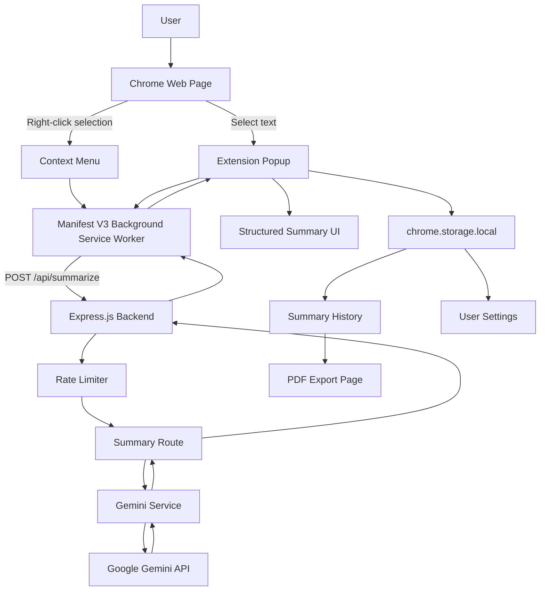
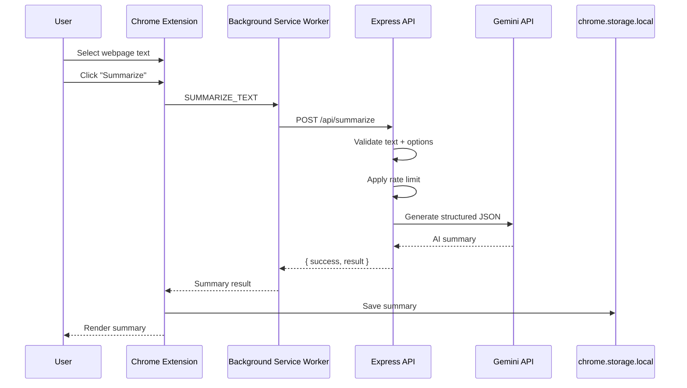
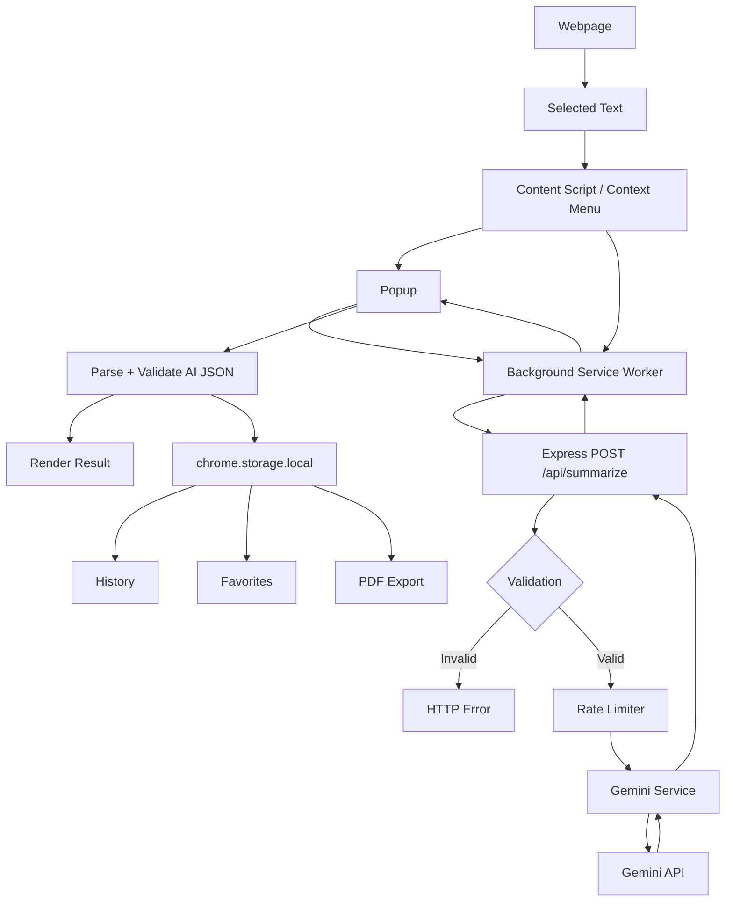

# AI Web Summarizer

<p align="center">
  <strong>Turn selected web content into structured, AI-powered summaries in seconds.</strong>
</p>

<p align="center">
  A privacy-conscious Chrome Extension built with Manifest V3, Gemini AI, and an Express.js backend for fast webpage summarization, key-point extraction, concept discovery, keyword extraction, and reading-time estimation.
</p>

<p align="center">
  <a href="https://github.com/tusharkkp/AI-Web-Summarizer-Extension/stargazers">
    
  </a>
  <a href="https://github.com/tusharkkp/AI-Web-Summarizer-Extension/network/members">
    
  </a>
  <a href="https://github.com/tusharkkp/AI-Web-Summarizer-Extension/issues">
    
  </a>
  <a href="https://github.com/tusharkkp/AI-Web-Summarizer-Extension/blob/main/LICENSE">
    
  </a>
  
</p>

<p align="center">
  
  
  
  
  
</p>

---

## Why AI Web Summarizer?

The modern web is full of useful information, but reading every article, documentation page, research post, tutorial, or long-form resource is time-consuming.

**AI Web Summarizer** lets you select the content you actually care about and transform it into a structured summary without leaving the browser.

It is designed as a practical **AI-powered Chrome extension** rather than a simple text-to-summary demo. The project separates the browser UI from AI processing, keeps the Gemini API key on the backend, stores summary history locally, and provides multiple controls for how the generated summary should look.

### The core idea

> **Select → Summarize → Understand → Save → Reuse**

---

## Problem Statement

People consume large amounts of information through websites every day:

- Technical documentation
- News articles
- Tutorials and blogs
- Research material
- Educational content
- Product and industry reports
- Long-form web pages

Reading everything in full can be inefficient when the immediate goal is to understand the main ideas.

Traditional browser workflows require users to:

1. Copy webpage content.
2. Open a separate AI tool.
3. Paste the content.
4. Write a summarization prompt.
5. Read the generated response.
6. Manually save useful information.

AI Web Summarizer reduces this friction by bringing **AI webpage summarization directly into the Chrome browsing workflow**.

### Pain points addressed

| Pain Point | Solution |
|---|---|
| Long webpages take time to understand | Generate concise AI summaries |
| Switching between browser and AI tools | Summarize directly from the extension |
| One-size-fits-all summaries | Choose length and writing style |
| Important details can be missed | Extract key points and concepts |
| Finding useful summaries later is difficult | Local summary history |
| API keys should not live in browser code | Gemini calls are handled by Express |
| Repeated API requests can become expensive | Backend rate limiting |
| AI output can be difficult to reuse | Copy and PDF export |

---

## Features

### 🤖 AI-Powered Summarization

- Summarize selected webpage text using **Google Gemini AI**.
- Generate structured output instead of an unformatted paragraph.
- Extract:
  - Summary
  - Key points
  - Key concepts
  - Keywords
  - Estimated reading time

### 🎛️ Custom Summary Controls

Choose how the AI should generate the result:

- **Length**
  - Short
  - Standard
  - Detailed
- **Style**
  - Balanced
  - Bullet points
  - Executive brief
  - Study notes
- **Language**
  - English
  - Hindi
  - Spanish
  - French
  - German

### 🌐 Browser Integration

- Chrome Manifest V3 extension.
- Summarize selected text from the extension popup.
- Right-click selected text and choose **Summarize with AI**.
- Uses a background service worker for extension-wide communication.
- Works with the current active browser tab.

### 🗂️ Summary History

- Automatically save generated summaries.
- Search previous summaries.
- Favorite important summaries.
- Delete summaries.
- View summary statistics.
- Copy saved summaries.
- Export summaries through the browser's PDF print flow.

### 🎨 User Experience

- Clean popup interface.
- Light and dark themes.
- Loading and error states.
- Toast notifications.
- Structured result cards.
- Responsive extension pages.

### 🔐 Security-Oriented Backend

- Gemini API key remains server-side.
- CORS allow-list support.
- JSON request-size limit.
- Maximum selected-text length.
- In-memory API rate limiter.
- Basic security response headers.
- `X-Powered-By` disabled.
- Prompt explicitly treats webpage content as source material rather than instructions.

---

# Architecture

AI Web Summarizer uses a **Chrome Extension + Express API + Gemini AI** architecture.

The browser extension is responsible for user interaction and local history, while the backend acts as the secure boundary for communication with Gemini.

## High-Level System Architecture



## Request Workflow



## Context-Menu Workflow


---

# How the Architecture Works

## 1. Chrome Extension

The extension is built using **Manifest V3**.

Major browser components include:

- `popup/` — primary user interface.
- `background/` — service worker and extension-wide communication.
- `content/` — extracts selected webpage text.
- `services/` — API and local storage abstractions.
- `history/` — summary history interface.
- `export/` — printable summary/PDF workflow.
- `utils/` — shared constants and formatting logic.

## 2. Background Service Worker

The service worker is the communication hub of the extension.

It:

- Creates the context-menu action.
- Receives selected text from the context menu.
- Stores pending selections.
- Communicates with the popup.
- Sends summarization requests to the Express backend.
- Keeps backend communication independent of the popup lifecycle.

## 3. Express Backend

The backend exposes a small REST API.

Responsibilities:

- Validate incoming text.
- Validate summary options.
- Enforce request limits.
- Apply CORS policy.
- Rate-limit summary requests.
- Call Gemini.
- Return AI-generated structured content.

## 4. Gemini AI

The backend sends the selected content to the **Google Gemini API** with instructions to return a predictable JSON structure containing:

```json
{
  "summary": "...",
  "keyPoints": ["..."],
  "keyConcepts": [
    {
      "term": "...",
      "explanation": "..."
    }
  ],
  "keywords": ["..."],
  "readingTime": "..."
}
```

## 5. Local Storage

The extension does **not currently use a traditional database**.

Instead, browser-local persistence is handled by:

```text
chrome.storage.local
```

It stores:

- Summary history
- Favorite status
- Theme preference
- Pending context-menu selection

This keeps the current architecture lightweight and avoids unnecessary database infrastructure.

---

# Tech Stack

## Frontend — Chrome Extension

| Technology | Purpose | Why it is used |
|---|---|---|
| HTML5 | Extension pages | Simple, native browser UI |
| CSS3 | Styling and themes | Lightweight UI without a frontend framework |
| JavaScript | Application logic | Direct access to Chrome Extension APIs |
| Chrome Extension APIs | Browser integration | Tabs, scripting, context menus, storage and messaging |
| Manifest V3 | Extension platform | Current Chrome extension architecture |

## Backend

| Technology | Purpose | Why it is used |
|---|---|---|
| Node.js | Server runtime | Lightweight JavaScript backend |
| Express.js | REST API | Simple and modular HTTP server |
| CORS | Origin control | Restrict browser requests to approved origins |
| dotenv | Environment configuration | Keeps secrets/configuration outside source code |

## AI / Machine Learning

| Technology | Purpose | Why it is used |
|---|---|---|
| Google Gemini API | Text summarization | Generates structured natural-language summaries |
| Gemini 2.5 Flash | Default model | Fast model suitable for interactive summarization |

## Browser Storage

| Technology | Purpose |
|---|---|
| `chrome.storage.local` | Summary history and settings |
| Chrome Tabs API | Access active browser tab |
| Chrome Scripting API | Extract selected webpage text |
| Chrome Context Menus API | Right-click summarization |
| Chrome Runtime Messaging | Popup ↔ service-worker communication |

## APIs

### Internal API

```text
POST /api/summarize
```

### External API

```text
Google Gemini Generative Language API
```

## Deployment

The repository currently targets **local development** by default:

```text
Chrome Extension
       ↓
http://localhost:3000
       ↓
Express Backend
       ↓
Gemini API
```

For production deployment, the backend can be hosted on a Node.js-compatible platform and exposed through HTTPS.

---

# Installation Guide

## Prerequisites

Install the following before starting:

- Google Chrome or a Chromium-based browser
- Node.js 18+ recommended
- npm
- A Google Gemini API key
- Git

Check Node.js and npm:

```bash
node --version
npm --version
```

---

## 1. Clone the Repository

```bash
git clone https://github.com/tusharkkp/AI-Web-Summarizer-Extension.git
cd AI-Web-Summarizer-Extension
```

---

## 2. Configure the Backend

Move into the backend directory:

```bash
cd backend
```

Install dependencies:

```bash
npm install
```

Create the environment file:

### Windows PowerShell

```powershell
Copy-Item .env.example .env
```

### macOS / Linux

```bash
cp .env.example .env
```

Open `backend/.env` and add your Gemini API key:

```env
GEMINI_API_KEY=your_gemini_api_key
GEMINI_MODEL=gemini-2.5-flash
PORT=3000

RATE_LIMIT_MAX=20
RATE_LIMIT_WINDOW_MS=600000
```

> **Never commit `backend/.env` to Git.** The real API key must remain outside the repository.

---

## 3. Start the Backend

From the `backend` directory:

```bash
npm start
```

For development with Node's watch mode:

```bash
npm run dev
```

The server will listen on:

```text
http://localhost:3000
```

---

## 4. Load the Chrome Extension

1. Open Chrome.
2. Navigate to:

```text
chrome://extensions
```

3. Enable **Developer mode**.
4. Click **Load unpacked**.
5. Select the project root folder:

```text
AI-Web-Summarizer-Extension/
```

6. The **AI Web Summarizer** extension should appear in your extensions list.
7. Pin the extension if desired.

---

## 5. Generate Your First Summary

1. Open any normal webpage.
2. Select a section of text.
3. Click the AI Web Summarizer extension.
4. Choose:
   - Summary length
   - Summary style
   - Output language
5. Click **Summarize selected text**.
6. Review the generated:
   - Summary
   - Key points
   - Key concepts
   - Keywords
   - Reading time

You can then copy, save, favorite, search, or export the result.

---

# Right-Click Summarization

The extension also supports a faster workflow.

1. Select text on a webpage.
2. Right-click.
3. Choose **Summarize with AI**.
4. The selection is handed to the extension background service worker.
5. Open the extension popup if Chrome does not automatically open it.
6. The selected text is summarized using the configured backend.

This workflow avoids manually copying text into the extension.

---

# Environment Variables

The backend includes an example configuration at:

```text
backend/.env.example
```

| Variable | Required | Default | Description |
|---|---:|---|---|
| `GEMINI_API_KEY` | Yes | — | Google Gemini API credential |
| `GEMINI_MODEL` | No | `gemini-2.5-flash` | Gemini model used for summarization |
| `PORT` | No | `3000` | Express server port |
| `CORS_ORIGINS` | Production recommended | — | Comma-separated allowed extension origins |
| `RATE_LIMIT_MAX` | No | `20` | Maximum requests per rate-limit window |
| `RATE_LIMIT_WINDOW_MS` | No | `600000` | Rate-limit window in milliseconds |

### Production CORS example

After loading the extension, Chrome gives it an extension ID.

Configure:

```env
CORS_ORIGINS=chrome-extension://YOUR_EXTENSION_ID
```

For multiple allowed origins:

```env
CORS_ORIGINS=chrome-extension://EXTENSION_ID_1,chrome-extension://EXTENSION_ID_2
```

---

# API Documentation

## `POST /api/summarize`

Generates an AI summary from selected webpage text.

### Request

```http
POST /api/summarize
Content-Type: application/json
```

### Request Body

```json
{
  "text": "Artificial intelligence is transforming...",
  "options": {
    "length": "standard",
    "style": "balanced",
    "language": "English"
  }
}
```

### Supported `length`

```text
short
standard
detailed
```

### Supported `style`

```text
balanced
bullet-points
executive
study-notes
```

### Supported `language`

```text
English
Hindi
Spanish
French
German
```

### Successful Response

```json
{
  "success": true,
  "result": "{\"summary\":\"...\",\"keyPoints\":[\"...\"],\"keyConcepts\":[{\"term\":\"...\",\"explanation\":\"...\"}],\"keywords\":[\"...\"],\"readingTime\":\"2 min\"}"
}
```

The extension parses the returned JSON string and validates the expected fields before saving the summary locally.

### Validation Errors

#### Empty text

```json
{
  "success": false,
  "message": "Text is required to generate a summary."
}
```

HTTP status:

```text
400 Bad Request
```

#### Text too large

The backend accepts a maximum of **40,000 characters**.

HTTP status:

```text
413 Payload Too Large
```

#### Rate limit exceeded

```json
{
  "success": false,
  "message": "Too many summary requests. Please try again shortly."
}
```

HTTP status:

```text
429 Too Many Requests
```

---

# Folder Structure

```text
AI-Web-Summarizer-Extension/
│
├── assets/
│   ├── icon16.png
│   ├── icon48.png
│   └── icon128.png
│
├── backend/
│   ├── middleware/
│   │   └── rateLimit.js
│   │
│   ├── routes/
│   │   └── summary.js
│   │
│   ├── services/
│   │   └── gemini.js
│   │
│   ├── .env.example
│   ├── .gitignore
│   ├── package.json
│   ├── package-lock.json
│   └── server.js
│
├── background/
│   └── background.js
│
├── content/
│   └── content.js
│
├── export/
│   ├── export.css
│   ├── export.html
│   └── export.js
│
├── history/
│   ├── history.css
│   ├── history.html
│   └── history.js
│
├── popup/
│   ├── popup.css
│   ├── popup.html
│   └── popup.js
│
├── services/
│   ├── api.js
│   ├── settings.js
│   └── storage.js
│
├── utils/
│   ├── constants.js
│   ├── formatter.js
│   └── helpers.js
│
├── manifest.json
└── README.md
```

### Directory Responsibilities

| Directory | Responsibility |
|---|---|
| `assets/` | Extension icons |
| `backend/` | Express API and Gemini integration |
| `background/` | Manifest V3 service worker |
| `content/` | Webpage text extraction |
| `export/` | Printable/PDF summary view |
| `history/` | Searchable local summary history |
| `popup/` | Main extension interface |
| `services/` | API, storage and settings abstractions |
| `utils/` | Shared constants and formatting helpers |

---

# Data Flow



---

# Screenshots

No dedicated product screenshots are currently included in the repository archive.

For the GitHub repository, adding screenshots is strongly recommended because browser-extension projects benefit from visual proof.

A professional screenshot section should eventually include:

### Main Popup

```text
docs/screenshots/popup-summary.png
```

Show:

- Summary controls
- Generated summary
- Key points
- Key concepts
- Keywords
- Reading time

### Summary History

```text
docs/screenshots/summary-history.png
```

Show:

- Search
- Favorites
- Saved summaries
- History statistics

### Context Menu

```text
docs/screenshots/context-menu.png
```

Show:

- Selected webpage text
- "Summarize with AI" context-menu action

### Dark Mode

```text
docs/screenshots/dark-mode.png
```

Show the extension's dark theme.

> Recommended GitHub practice: use descriptive, lowercase, hyphen-separated filenames such as `popup-summary.png` instead of names such as `Screenshot_2026-08-09.png`.

---

# Security & Privacy

Security is an important part of the architecture.

## API Key Protection

The Gemini API key is stored in:

```text
backend/.env
```

It is **not embedded inside the Chrome extension**.

The extension communicates with the Express backend, and the backend communicates with Gemini.

```text
Chrome Extension
      ↓
Express Backend
      ↓
Gemini API
```

This prevents the Gemini API key from being directly exposed in client-side extension code.

## Request Protection

The backend currently includes:

- 40,000-character maximum input.
- 200 KB JSON body limit.
- CORS configuration.
- In-memory rate limiting.
- `X-Content-Type-Options: nosniff`.
- `Referrer-Policy: no-referrer`.
- Disabled Express `X-Powered-By` header.

## Prompt Injection Consideration

Web content can contain text that looks like instructions.

The Gemini prompt explicitly separates webpage content from the summarization instructions and tells the model to treat the supplied content as **source material, not instructions**.

This is an important baseline defense for an AI application processing untrusted webpage content.

## Privacy Consideration

When a user requests a summary, the selected text is sent from the extension to the configured backend and then to the Gemini API for processing.

The extension currently stores generated summaries locally using `chrome.storage.local`.

Before public distribution, add a complete privacy policy describing:

- What information is processed.
- Where selected text is sent.
- How Gemini is used.
- What is stored locally.
- Whether server-side logs are retained.
- How users can request deletion, if applicable.

---

# Performance & Scalability

The project is intentionally lightweight for local and small-scale usage.

## Current Optimizations

- Only **selected text** is sent rather than an entire webpage.
- Text input is capped at 40,000 characters.
- The extension avoids a traditional database.
- Browser-local storage keeps history operations simple.
- The background service worker centralizes API communication.
- The backend validates inputs before invoking Gemini.
- Rate limiting reduces uncontrolled request volume.
- JSON response format makes client-side rendering predictable.

## Current Scalability Limitation

The current rate limiter uses an in-memory JavaScript `Map`.

That works for a single backend instance, but it is **not suitable for horizontally scaled production deployments**, because each server instance would maintain its own request counters.

A production deployment should consider:

- Redis-backed rate limiting.
- Reverse proxy rate limiting.
- Centralized logging.
- Request IDs and observability.
- Authentication or user-level quotas.
- Queue-based processing for high-volume workloads.
- Persistent server-side analytics if required.

## Modularity

The codebase separates:

```text
UI
↓
Extension Services
↓
Background Worker
↓
REST API
↓
AI Service
```

This makes it easier to replace:

- Gemini with another LLM provider.
- Chrome storage with a database.
- The extension UI with another frontend approach.
- The local backend with a production cloud service.

---

# Production Deployment

The repository is configured for local development by default.

For a production release:

### 1. Deploy the Express backend

Use any Node.js-compatible hosting platform that supports HTTPS.

### 2. Configure environment variables

Set:

```env
GEMINI_API_KEY=...
GEMINI_MODEL=gemini-2.5-flash
PORT=...
CORS_ORIGINS=chrome-extension://YOUR_EXTENSION_ID
```

### 3. Update the extension backend URL

The current extension uses:

```js
const BACKEND_URL = "http://localhost:3000";
```

Change this to your HTTPS backend URL before production packaging.

### 4. Review Chrome extension permissions

Keep permissions limited to what the extension actually requires.

### 5. Publish a privacy policy

This is especially important before distributing the extension publicly.

---

# Build & Release Checklist

Before publishing a release:

- [ ] Backend deployed with HTTPS.
- [ ] `GEMINI_API_KEY` stored only as a server environment variable.
- [ ] `CORS_ORIGINS` configured.
- [ ] Production `BACKEND_URL` configured.
- [ ] Rate limiting reviewed.
- [ ] Privacy policy published.
- [ ] Extension permissions reviewed.
- [ ] Error states tested.
- [ ] Context-menu workflow tested.
- [ ] Popup workflow tested.
- [ ] PDF export tested.
- [ ] History/search/favorites tested.
- [ ] Chrome extension package tested on a clean browser profile.
- [ ] README screenshots added.
- [ ] License included.
- [ ] Version number updated in `manifest.json`.

---

# Future Scope

The current architecture provides a strong base for a more advanced AI reading assistant.

## Planned / Potential Enhancements

### 🧠 Smarter AI Features

- Full-page summarization.
- Multi-page summarization.
- Article-aware summarization.
- Automatic topic classification.
- Fact extraction.
- Question answering over selected content.
- Follow-up chat with the summarized webpage.
- Custom user prompts.
- Source-grounded answers.
- Multiple AI model support.

### 📚 Knowledge Management

- Cloud synchronization.
- Collections and folders.
- Tags.
- Advanced semantic search.
- Vector embeddings.
- Personal knowledge base.
- Export to Markdown.
- Export to Notion or other productivity tools.

### 🌍 Browser Support

- Firefox extension.
- Microsoft Edge support.
- Additional Chromium-based browsers.

### 🚀 Infrastructure

- Redis-based distributed rate limiting.
- User authentication.
- Usage quotas.
- Analytics dashboard.
- Centralized logging.
- Automated CI/CD.
- Automated tests.

### 🔒 Security

- Stronger content isolation.
- Request authentication.
- Abuse prevention.
- Secure production secrets management.
- Privacy-preserving telemetry.

---

# Contributing

Contributions are welcome.

If you want to improve the project:

## 1. Fork the repository

Click **Fork** on GitHub.

## 2. Clone your fork

```bash
git clone https://github.com/YOUR_USERNAME/AI-Web-Summarizer-Extension.git
cd AI-Web-Summarizer-Extension
```

## 3. Create a feature branch

```bash
git checkout -b feature/your-feature-name
```

Examples:

```text
feature/full-page-summary
feature/firefox-support
feature/markdown-export
fix/context-menu-error
fix/gemini-response-parser
```

## 4. Make your changes

Keep changes focused and maintain the existing separation between:

- Extension UI
- Browser services
- Background worker
- Backend routes
- AI service

## 5. Test locally

At minimum, verify:

- Extension loads without errors.
- Text selection works.
- Popup summarization works.
- Context-menu summarization works.
- Backend API responds correctly.
- Invalid requests return useful errors.
- History is persisted.
- Favorites work.
- PDF export works.

## 6. Commit

Use clear commit messages:

```bash
git add .
git commit -m "feat: add full-page summarization"
```

## 7. Push and open a Pull Request

```bash
git push origin feature/your-feature-name
```

Then open a pull request against the `main` branch.

### Good issues include

- Clear reproduction steps.
- Expected behavior.
- Actual behavior.
- Browser/OS information when relevant.
- Console or backend error messages.
- Screenshots for UI problems.

---

# Roadmap

```text
Current
  │
  ├── Selected-text AI summarization
  ├── Gemini integration
  ├── Context-menu workflow
  ├── Summary history
  ├── Favorites + search
  ├── PDF export
  └── Light/dark mode
        │
        ▼
Next
  │
  ├── Full-page summarization
  ├── Better source extraction
  ├── Custom prompts
  ├── Markdown export
  └── Improved testing
        │
        ▼
Advanced
  │
  ├── Follow-up AI chat
  ├── Knowledge base
  ├── Cloud sync
  ├── Multi-model support
  └── Cross-browser support
```

---

# Why This Project?

AI Web Summarizer is more than a basic Gemini API demo.

It demonstrates how to combine:

- Browser extension development
- Manifest V3 architecture
- Chrome Extension APIs
- JavaScript application design
- REST API development
- Express.js backend engineering
- Generative AI integration
- Prompt engineering
- Structured AI output
- Local browser storage
- API security practices
- Rate limiting
- CORS configuration
- User-focused UI/UX

It is a practical example of building a **full-stack AI browser extension** with a clear separation between client-side functionality and server-side AI access.

---

# SEO Keywords

AI Web Summarizer naturally targets searches and use cases around:

**AI web summarizer, AI Chrome extension, webpage summarizer, Chrome summarization extension, Gemini Chrome extension, Gemini AI summarizer, AI article summarizer, webpage text summarizer, browser AI assistant, selected text summarizer, AI reading assistant, Chrome Manifest V3 extension, Express.js AI backend, Gemini API Node.js, JavaScript AI project, generative AI browser extension, AI productivity tool, automatic webpage summary, key points extractor, AI study notes generator.**

---

# License

This project is released under the **MIT License**.

See [`LICENSE`](./LICENSE) for the complete license text.

The MIT License permits users to use, copy, modify, merge, publish, distribute, sublicense, and sell copies of the software, subject to the license terms.

---

# Author & Credits

## Tushar Kaldate

Computer Engineering student and developer interested in **AI, full-stack development, software engineering, and practical developer tools**.

- GitHub: [@tusharkkp](https://github.com/tusharkkp)
- LinkedIn: [Tushar Kaldate](https://www.linkedin.com/in/tushar-kaldate-2b5276262/)

### Built With

- Google Gemini API
- Node.js
- Express.js
- Chrome Extensions API
- Manifest V3

---

# Support the Project

If you find **AI Web Summarizer** useful:

⭐ **Star the repository** to support the project.

🍴 **Fork it** and build your own AI-powered browser workflows.

🐛 **Open an issue** if you find a bug.

💡 **Suggest a feature** if you have an idea.

🤝 **Contribute** through a pull request.

Repository:

**https://github.com/tusharkkp/AI-Web-Summarizer-Extension**

---

<p align="center">
  <strong>Read less. Understand more.</strong>
</p>

<p align="center">
  Built with JavaScript, Express.js, and Gemini AI.
</p>
